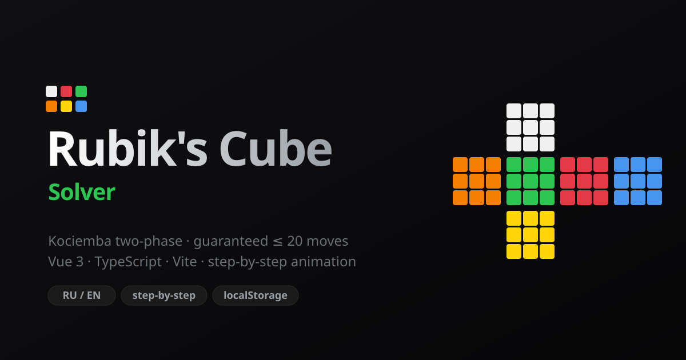

<div align="center">



# 🧩 Rubik's Cube Solver

**Paint your scrambled cube, validate it, and get an optimal solution — animated, step by step.**

[](https://vuejs.org/)
[](https://www.typescriptlang.org/)
[](https://vite.dev/)
[](https://eslint.org/)
[](./LICENSE)
[](https://github.com/i5anin/rubik/pulls)

[**🚀 Live Demo**](https://rubik-zeta.vercel.app) · [Report Bug](https://github.com/i5anin/rubik/issues) · [Request Feature](https://github.com/i5anin/rubik/issues)

**English** · [Русский](./README.ru.md)

</div>

---

## ✨ Features

| | |
|---|---|
| 🎨 **Visual input** | Click stickers on an unfolded cross layout. Hover any sticker to read its colour. Centres are locked — they define each face. |
| ✅ **Live validation** | Instant feedback on colour counts (9 of each). Hover the status chip for a per-colour bar chart. Parity is verified by the solver. |
| ⚡ **Optimal solving** | [Kociemba's two-phase algorithm](https://kociemba.org/cube.htm) — every cube solved in **≤ 20 moves**, in well under a second. |
| 🎞️ **Step-by-step playback** | Apply moves one at a time. The active face lights up and **spins in-plane** toward its target; stickers update mid-turn. Undo any step. |
| 🌍 **Bilingual** | Russian / English, auto-detected from your OS locale, switchable in one click, persisted to `localStorage`. |
| 💾 **Save & share** | Store cube states locally, rename them, and export / import the whole collection as JSON. |
| 🧭 **Plain-language moves** | No cryptic `R U R'` — every step reads *"Right: look from the right → turn clockwise ↻"*. |

---

## 🚀 Quick start

```bash
git clone https://github.com/i5anin/rubik.git
cd rubik
npm install
npm run dev          # http://localhost:5173
```

```bash
npm run build        # type-check (vue-tsc) + production bundle → dist/
npm run preview      # serve the production build locally
npm run lint         # ESLint (strict, type-checked)
```

---

## 🧠 How it works

The solver is built on [**`cubejs`**](https://github.com/ldez/cubejs), a JavaScript port of Herbert Kociemba's **two-phase algorithm**:

1. **Phase 1** moves the cube into the subgroup `G₁ = ⟨U, D, R², L², F², B²⟩` — every edge and corner correctly *oriented*.
2. **Phase 2** solves within `G₁` using only those restricted turns, reaching the solved state.

The search is iterative-deepening A\* over pre-computed pruning tables, so it always returns a sequence of **at most 20 moves** (the diameter of the cube group in the half-turn metric — "God's Number").

Cube state is encoded as a 54-character **URFDLB** string and validated structurally (nine of each colour, fixed centres) before solving — an impossible cube never reaches the engine.

---

## 🛠️ Tech stack

| Layer | Choice | Why |
|---|---|---|
| Framework | **Vue 3.5** `<script setup>` | Reactive, minimal, composable |
| Language | **TypeScript 6** (strict) | Type-safe i18n keys, discriminated unions, `satisfies` |
| Build | **Vite 8** | Instant HMR, lean production bundle (~43 kB gzip) |
| Solver | **cubejs** | Kociemba two-phase, ≤ 20 moves |
| Quality | **ESLint 10** + typescript-eslint (strict, type-checked) | Zero-warning policy |

---

## 📁 Project structure

```
src/
├─ types/cube.ts          # FaceLetter derived from FACE_ORDER — one source of truth
├─ i18n.ts                # type-safe translations (keys are a template-literal union)
├─ lib/cubejs.ts          # single, documented interop site for the solver
├─ composables/
│  ├─ useCube.ts          # reactive cube state + discriminated-union validation
│  ├─ useSolver.ts        # Kociemba wrapper, reactive solve steps
│  └─ useSavedConfigs.ts  # localStorage persistence + JSON export/import
└─ components/
   ├─ FaceGrid.vue        # one face: painting, hover tooltips, spin animation
   ├─ SolutionPanel.vue   # step list, progress, per-step apply/undo
   ├─ ValidationChip.vue  # status chip + per-colour bar chart on hover
   ├─ SavedConfigs.vue    # saved states list
   └─ HeaderLinks.vue     # language toggle, links, algorithm info
```

---

## 🤝 Contributing

Issues and pull requests are welcome. The codebase holds a **zero-warning** bar — run `npm run lint` and `npm run build` before opening a PR.

## 📄 License

[MIT](./LICENSE)

<div align="center">
<sub>Hold the cube <b>white-up, green-front</b> · built with Vue 3 + TypeScript</sub>
</div>
